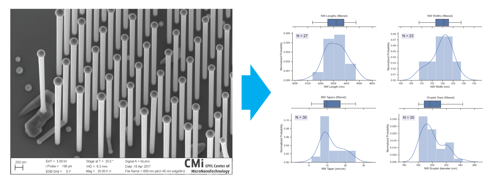

# DeepSEM
A deep neural net approach to nanostructure analysis in scanning electron microscope (SEM) images using [detectron2](https://github.com/facebookresearch/detectron2).

## Introduction
Machine learning and neural network techniques offer exciting new possibilities in all fields of science and engineering. Some recent examples include detecting 2D materials [[REF](https://journals.aps.org/prapplied/abstract/10.1103/PhysRevApplied.13.064017),[REF](https://www.nature.com/articles/s41699-020-0137-z)] and battery degredation research [[REF](https://www.nature.com/articles/s41467-020-16233-5)]. Nevertheless, general adoption is slow due to the steep learning curve resulting in a high barrier to entry for people wihtout computer science backgrounds.

During my PhD at the [Laboratory of Semiconductor Materials (LMSC)](https://www.epfl.ch/labs/lmsc/) at [EPFL](https://www.epfl.ch/en), one of the most tedious and time-consuming tasks was the analysis of scanning electron microscope (SEM) images. This analysis was a necessary evil in order to obtain quantitative and comparable data to improve the growth parameters for creating our nanostructures. 

For my post-doc at LMSC, following my PhD, I thus looked at answering the question: **How can we use advanced ML techniques to extract quantiative information from SEM images in a scalable way?** 

This repository is my attempt to share what I have learned through easy-to-use tutorials and Google Colab scripts. My hope is that these codes will help lower the barrier to entry for other researchers looking to apply similar techniques in their own workflows.

## Content
The code in this project is divided up by problem/use case:
1. [Object detection for nanowire growth yield analysis](nanowire_yield)
2. [Image segmentation for nanowire dimension analysis](nanowire_segmentation)
