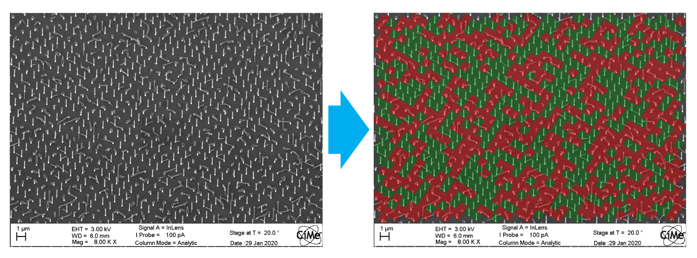

# Nanowire Yield Analysis

## Goal
The goal of this application was to calculate nanowire (NW) growth yield using deep neural nets optimized for object detection. NWs are grown using [molecular beam epitaxy (MBE)](https://en.wikipedia.org/wiki/Molecular-beam_epitaxy) on a patterned substrate. The NWs are grown in specific positions in a grid-like pattern however, in general, each growth position does not always yield a NW with 100% certainty. Therefore, it is important to characterize what the yield was in a particular growth so that we can modify the growth conditions/substrate preparation to maximize yield in subsequent growths.

## Colab Notebooks
There are three Jupyter notebooks in this application, each one representing an incremental step in achieving the final goal. These have been designed to run inside of a Google Colab instance for its ease of use, cross-platform compatiblity and access to GPUs for training. Here are the direct links to the Colab notebooks:
1. [Training data preparation](https://colab.research.google.com/github/Martin09/DeepSEM/blob/master/nanowire_yield/1_nw_yield_image_prep.ipynb)
2. [Model creation and training](https://colab.research.google.com/github/Martin09/DeepSEM/blob/master/nanowire_yield/2_nw_yield_training.ipynb)
3. [Loading and using a trained model](https://colab.research.google.com/github/Martin09/DeepSEM/blob/master/nanowire_yield/3_nw_yield_yield_analysis.ipynb)

## Summary
The training data in this example consists of SEM images that have been sub-divided into six smaller images. This has been done to reduce the number of objects in each image to only a few hundred which makes labelling and training more manageable. See [Notebook 1](https://colab.research.google.com/github/Martin09/DeepSEM/blob/master/nanowire_yield/1_nw_yield_image_prep.ipynb), as mentioned above, for more details. The sub-divided images are then saved in PNG format and uploaded to a [Labelbox](https://labelbox.com) project for easy labelling using bounding boxes on their platform. Once labeling is complete, the labels can be exported from Labelbox, uploaded to Colab and used for training which is the topic of [Notebook 2](https://colab.research.google.com/github/Martin09/DeepSEM/blob/master/nanowire_yield/2_nw_yield_training.ipynb). Finally, applying a trained model to a full-scale SEM image for yield analysis, including post-processing of neural network output, is covered in [Notebook 3](https://colab.research.google.com/github/Martin09/DeepSEM/blob/master/nanowire_yield/3_nw_yield_yield_analysis.ipynb).

## Acknowledgements
Thanks to Lucas Güniat for providing me with these SEM images of GaAs NWs grown on Si nanopillars. For more information about his work you can check out his paper [here](https://pubs.acs.org/doi/abs/10.1021/acsnano.9b01546).
