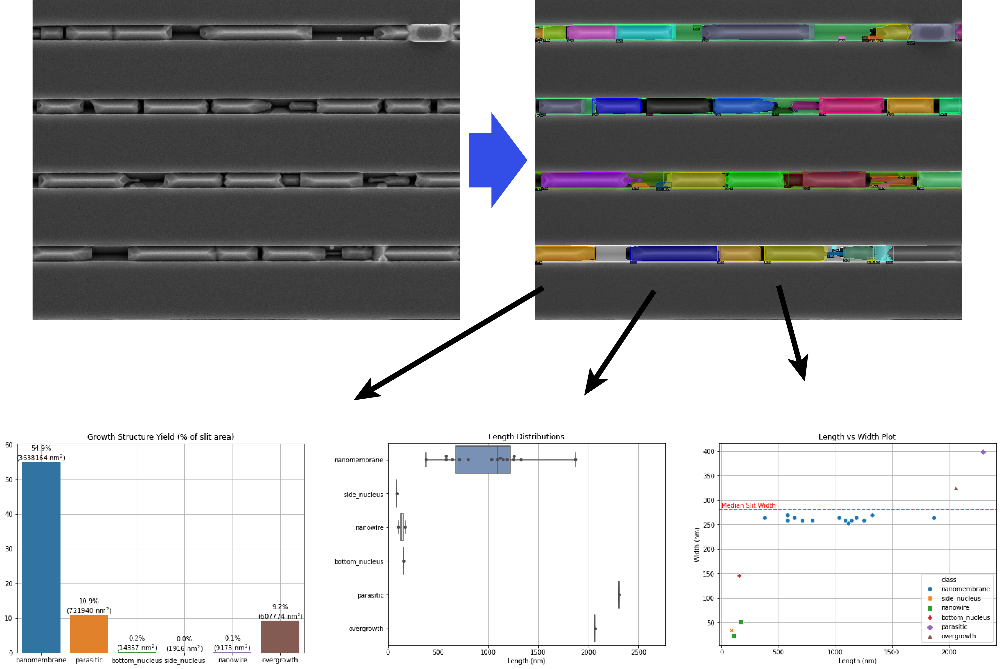
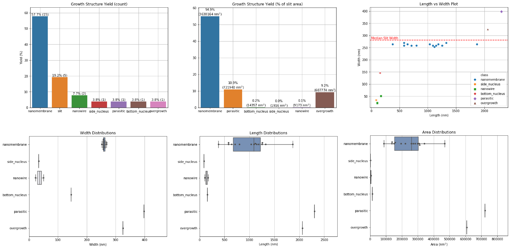

# Nanomembrane Growth Analysis

## Goal
The goal of this application was to calculate nanomembrane (NM) growth yield and dimensions using deep neural nets. These NMs were grown using [metalorganic vapour-phase epitaxy (MOVPE)](https://en.wikipedia.org/wiki/Metalorganic_vapour-phase_epitaxy) on an SiO2-covered substrate patterned with trenches. The NMs are then grown within these trenches, however we observe not only NMs that grow but also many other structures. Therefore, it is important to characterize what the NM yield is in a particular growth so that we can modify the growth conditions/substrate preparation to maximize yield in subsequent growths. At the same time, we would like to characterize the lengths and widths of NMs that grew well in order to get an idea about which growth conditions give the longest continuous NMs.

## Colab Notebooks
There are three Jupyter notebooks in this tutorial, each one representing an incremental step in achieving the above goal. These have been designed to run inside of a Google Colab instance for its ease of use, cross-platform compatiblity and access to GPUs for faster training. Here are the direct links to the Colab notebooks:
1. [Training data preparation](https://colab.research.google.com/github/Martin09/DeepSEM/blob/master/segmentation-NMs/1_nm_seg_image_prep.ipynb)
2. [Model creation and training](https://colab.research.google.com/github/Martin09/DeepSEM/blob/master/segmentation-NMs/2_nm_seg_training.ipynb)
3. [Loading and using a trained model](https://colab.research.google.com/github/Martin09/DeepSEM/blob/master/segmentation-NMs/3_nm_seg_inference.ipynb)

## Summary
The training data in this example consists of SEM images all taken at 0° tilt and 50k magnification. Since we are performing image segmentation, we need a high-resolution image to generate accurate segmentation masks. Therefore the full 1024x768 SEM image resolution is used for training. Furthermore, the images used were saved by Zeiss' software without any annotations, therefore we do not need to do any image cropping during image preparation.  See [Notebook 1](https://colab.research.google.com/github/Martin09/DeepSEM/blob/master/segmentation-NMs/1_nm_seg_image_prep.ipynb), as mentioned above, for information on how the images can be filtered according to magnification and saved in PNG format. For labelling, the PNG files are uploaded to a [Labelbox](https://labelbox.com) project for easy labelling with segmentation masks in a collaborative project supporting multiple labellers. Once labeling is complete, the labels can be exported from Labelbox and uploaded to Google Colab for use in training which is the topic of [Notebook 2](https://colab.research.google.com/github/Martin09/DeepSEM/blob/master/segmentation-NMs/2_nm_seg_training.ipynb). Finally, using a trained model for labelling a new SEM image, including post-processing of neural network output, is covered in [Notebook 3](https://colab.research.google.com/github/Martin09/DeepSEM/blob/master/segmentation-NMs/3_nm_seg_inference.ipynb).

## Results
In this project we succeeded in training a neural network to classify and segment different types of growth structures that we identified in our SEM images. A subset of this analysis is shown as an example below:

From here, we could take the output of the neural network and perform further analysis which yields important information such as growth yield and various size distributions of each class:

The most exciting part about this approach is that it scales very well to a large number of images. Furthermore, with more training data it will become more and more accurate over time.

## Acknowledgements
Thanks to Nicholas Morgan for providing me with these SEM images of GaAs NMs grown in Si trenches and for helping me with the image labeling. If you are interested in learning more about this research, feel free to check out [this](https://pubs.rsc.org/en/content/articlehtml/2020/nr/c9nr08453c) paper.
