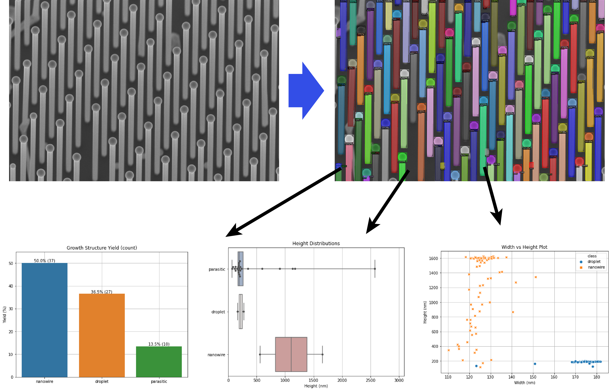
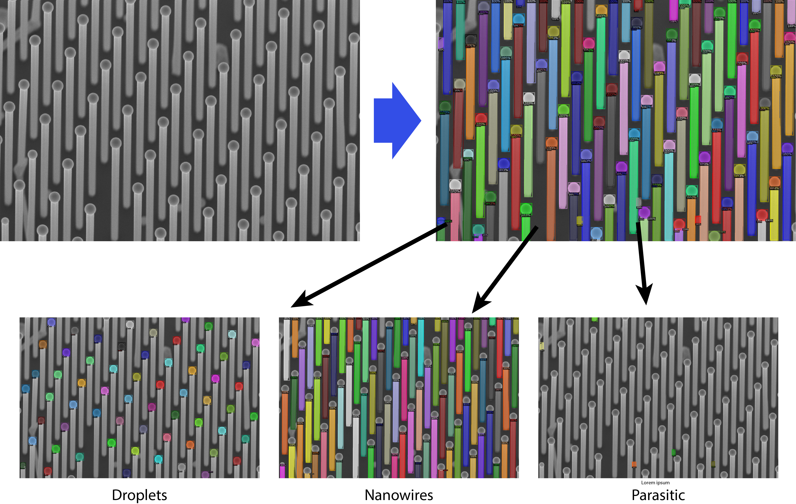
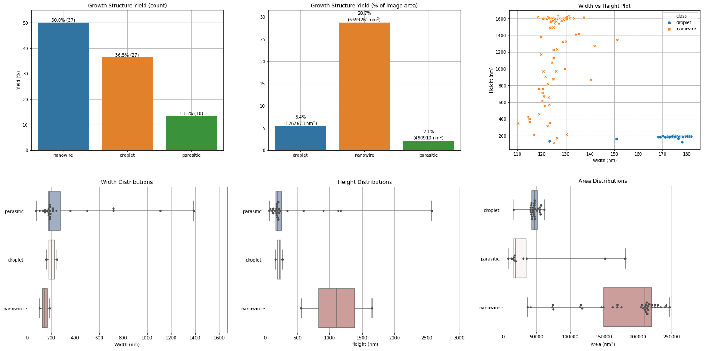

# Veritcal Nanowire Growth Analysis

## Goal
Similarly to the [nanomembrane segmentation tutorial](https://github.com/Martin09/DeepSEM/tree/master/segmentation-NMs), the goal of this application was to calculate nanowire (NW) growth yield and dimensions using deep neural nets. These NWs were grown using [molecular beam epitaxy (MBE)](https://en.wikipedia.org/wiki/Molecular-beam_epitaxy) on an SiO2-covered substrate patterned with holes. The NWs are grown selectively from these holes. Often, the selectivity of the SiO2 and NW growth yield isn't perfect. Therefore, it is important to characterize the NW growth yield in a particular growth so that we can modify the growth conditions/substrate preparation to maximize yield in subsequent growths. At the same time, we would like to characterize the lengths and widths of NWs that grew well in order to get an idea about which growth conditions give the longest NWs.

## Colab Notebooks
There are three Jupyter notebooks in this tutorial to achieve the above goal. As in the other tutorials, these have been designed to run inside of a Google Colab instance for its ease of use, cross-platform compatiblity and access to GPUs for faster training. Here are the direct links to the Colab notebooks:
1. [Image preparation and labelling](https://colab.research.google.com/github/Martin09/DeepSEM/blob/master/segmentation-NWs/1_nw_seg_image_prep.ipynb)
2. [Model training](https://colab.research.google.com/github/Martin09/DeepSEM/blob/master/segmentation-NWs/2_nw_seg_training.ipynb)
3. [Inference and post-processing](https://colab.research.google.com/github/Martin09/DeepSEM/blob/master/segmentation-NWs/3_nw_seg_inference.ipynb)

## Summary
The training data in this example consists of high-resolution SEM images all taken at 20° tilt and 20k magnification. The full 1024x768 SEM image resolution is used for training, minus the overlay at the bottom of the image. See [Notebook 1](https://colab.research.google.com/github/Martin09/DeepSEM/blob/master/segmentation-NMs/1_nw_seg_image_prep.ipynb), for information on how the images can be filtered according to magnification and saved in PNG format. For labelling, the PNG files are uploaded to a [Labelbox](https://labelbox.com) project for easy labelling with segmentation masks in a collaborative project supporting multiple labellers. Once labeling is complete, the labels can be exported from Labelbox and uploaded to Google Colab for use in training which is the topic of [Notebook 2](https://colab.research.google.com/github/Martin09/DeepSEM/blob/master/segmentation-NMs/2_nw_seg_training.ipynb). Finally, using a trained model for labelling a new SEM image, including post-processing of neural network output, is covered in [Notebook 3](https://colab.research.google.com/github/Martin09/DeepSEM/blob/master/segmentation-NMs/3_nw_seg_inference.ipynb).

## Results
In this project we succeeded in training a neural network to classify and segment different parts of a NW that we identified in our SEM images. A subset of this analysis is shown as an example below:

From here, we could take the output of the neural network and perform further analysis which yields important information such as growth yield and various size distributions of each class:

The most exciting part about this approach is that it scales very well to a large number of images. Furthermore, with more training data it will become more and more accurate over time.

## Acknowledgements
Thanks to Wonjong Kim for providing me with these SEM images of GaAs NWs grown on Si. If you are interested in learning more about this research, feel free to check out [this](https://www.nature.com/articles/s41467-019-08807-9) paper.
